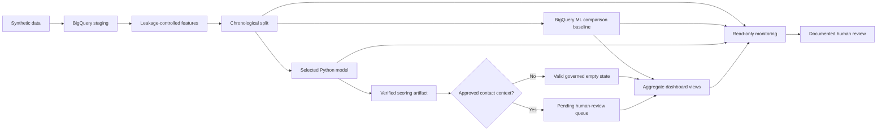

 Vitality Engagement Intelligence Engine

An end-to-end machine-learning portfolio demonstrating leakage-controlled prediction of near-term disengagement in a fully synthetic wellness-programme dataset, verified scoring artifacts, governed pending-human-review recommendations, aggregate dashboard evidence, and read-only monitoring.

> **Governance boundary:** This is a synthetic, non-clinical, non-operational technical demonstration. Forecasts are not confirmed outcomes. No model, dashboard, activation record, or monitoring result authorises member contact or any other operational action.

## Current status

Stages 1–8 are complete. **Stage 8 — Final documentation and portfolio polish** is complete.

| Stage | Outcome | Status |
| --- | --- | --- |
| Stage 1 — Repository foundation | Typed Python package, development controls, tests, and CI-ready quality tooling | Complete |
| Stage 2 — Synthetic data | Reproducible generation, validation, export, dataset card, and distribution review | Complete |
| Stage 3 — BigQuery and SQL | Staging, leakage-controlled features, chronological splits, and BigQuery ML comparison baseline | Complete |
| Stage 4 — Python modelling | Selected logistic model, frozen threshold, verified persistence, and scoring artifacts | Complete |
| Stage 5 — Governed activation | Deterministic policy, valid empty state, capacity controls, and mandatory human review | Complete |
| Stage 6 — Aggregate dashboard | Five-page Looker Studio report backed only by governed BigQuery views | Complete |
| Stage 7 — Monitoring | Local drift checks plus read-only BigQuery model and governance monitoring | Complete |
| Stage 8 — Portfolio documentation | Architecture overview, reproducibility guide, evidence index, and final repository polish | Complete |

The Stage 7 evidence run completed with 53 passing checks, two warnings, and two critical findings. Those findings remain visible and were not suppressed by weakening thresholds.

## Architecture overview

The full architecture, lineage, cloud configuration, fail-closed controls, and human-review boundaries are documented in the [project architecture](docs/project_architecture.md).



The diagram represents a technical repository workflow. It does not imply live production orchestration, automated outreach, or deployment.

## Stage-by-stage outcomes

### Stage 1 — Repository foundation

The project uses a typed `src/` package layout, `pyproject.toml`, Ruff, mypy, pytest, pre-commit, and version-controlled SQL and documentation.

### Stage 2 — Synthetic data

The synthetic dataset represents 500 synthetic members and was reviewed for structure, distributions, configured data-quality behaviour, and leakage risks. It is approved only for portfolio development and technical testing.

Evidence:

- [Synthetic dataset card](docs/data_card.md)
- [Dataset distribution review](docs/data_distribution_review.md)

### Stage 3 — BigQuery and SQL

Stage 3 created governed staging, 28-day historical features, chronological modelling splits, BigQuery ML evaluation assets, and scoring views in project `vitality-engagement-43999`, dataset `vitality_engagement_dev`, region `asia-southeast1`.

The Stage 3 model is the separate comparison baseline `bigquery_logistic_baseline` with threshold `0.467`.

Evidence:

- [BigQuery architecture](docs/bigquery_architecture.md)
- [BigQuery baseline results](docs/bigquery_baseline_results.md)

### Stage 4 — Python modelling and verified scoring

Stage 4 exported the chronological modelling dataset, compared a regularised logistic pipeline with a nonlinear challenger on validation data, selected the logistic model, persisted the trusted model and metadata, and generated verified scoring artifacts.

The selected model is `python_logistic_baseline` with threshold `0.431`.

Evidence:

- [Python logistic baseline results](docs/python_logistic_baseline_results.md)
- [Model card](docs/model_card.md)

### Stage 5 — Governed activation

Stage 5 applies deterministic permission, suppression, recency, cooldown, prior-intervention, and capacity rules when legitimate approved contact context exists.

The repository intentionally provides no default production contact-context artifact. When approved context is unavailable, the empty activation state is valid.

Selected rows remain `pending_human_review`. Selected for review does not mean approved outreach.

Evidence:

- [Activation policy](docs/activation_policy.md)
- [Activation runbook](docs/activation_runbook.md)

### Stage 6 — Aggregate dashboard

The validated Looker Studio report contains five pages and consumes governed BigQuery views only. The retained evidence covers eight governed dashboard assets and seven lineage rows.

The dashboard is aggregate-only, read-only, descriptive, non-operational, and protected by a subgroup suppression minimum of 10. It contains no member search, member-level export, dispatch control, outreach approval, or write-back.

Evidence:

- [Dashboard requirements](docs/dashboard_requirements.md)
- [Dashboard metric inventory](docs/dashboard_metric_inventory.md)
- [Stage 6 dashboard evidence](docs/stage_6_dashboard_evidence.md)
- [Retained dashboard assets](dashboards/)

### Stage 7 — Monitoring and governance

Stage 7 added fail-closed local Python monitoring and two read-only BigQuery views:

- `vitality_engagement_dev.model_monitoring_status`
- `vitality_engagement_dev.governance_monitoring_status`

Both BigQuery views set `operational_action_authorised` to `FALSE`.

Evidence:

- [Monitoring policy](docs/monitoring_policy.md)
- [Monitoring runbook](docs/monitoring_runbook.md)
- [Stage 7 monitoring evidence](docs/stage_7_monitoring_evidence.md)

### Stage 8 — Portfolio documentation

Stage 8 consolidates reviewer-facing architecture, reproducibility, evidence navigation, responsible-use boundaries, and repository hygiene without reinterpreting or hiding the retained evidence from earlier stages.

Deliverables:

- [Project architecture](docs/project_architecture.md)
- [Reproducibility guide](docs/reproducibility_guide.md)
- [Evidence index](docs/evidence_index.md)

## Synthetic data and governance notice

All data, members, events, labels, predictions, activation examples, dashboard results, and monitoring findings in this project are synthetic.

The project is not a clinical system and must not be used to:

- diagnose or infer real health conditions;
- determine treatment, benefits, or eligibility;
- penalise members;
- contact members automatically;
- claim causal intervention effects;
- represent forecasts as confirmed outcomes;
- replace authorised human review.

A passing technical check does not establish real-world validity, fairness, privacy compliance, legal compliance, causal effectiveness, or production readiness.

## Model results

### Chronological modelling dataset

| Split | Rows | Date range | Purpose |
| --- | ---: | --- | --- |
| Train | 46,000 | 2025-01-29 to 2025-04-30 | Model fitting |
| Validation | 15,500 | 2025-05-01 to 2025-05-31 | Model comparison and threshold selection |
| Test | 11,000 | 2025-06-01 to 2025-06-22 | Frozen logistic audit |
| Scoring | 3,500 | 2025-06-23 to 2025-06-29 | Unlabelled historical forecasts |

The dataset contains 47 approved predictors: three categorical and 44 numeric. Member identifiers, prediction dates, targets, split labels, and future-derived fields are excluded from the predictor matrix.

### Model identity boundary

| Model | Threshold | Role |
| --- | ---: | --- |
| `python_logistic_baseline` | `0.431` | Selected Stage 4 Python model used for verified scoring |
| `bigquery_logistic_baseline` | `0.467` | Stage 3 BigQuery ML comparison baseline |

The model names and thresholds must remain together. Neither threshold may be transferred to the other model.

### Selected Python model performance

| Metric | Validation | Frozen test audit |
| --- | ---: | ---: |
| ROC-AUC | 0.9476 | 0.9565 |
| PR-AUC | 0.8705 | 0.9114 |
| Positive-class F1 | 0.7721 | 0.8153 |
| Brier score | 0.0733 | 0.0690 |
| Expected calibration error | 0.0136 | 0.0095 |
| Top-decile lift | 4.1395 | 3.6833 |

The logistic specification and threshold were frozen before the test audit. However, the test result had already been viewed before nonlinear-model development began. It is therefore a valid frozen-logistic audit, but not a completely untouched cross-model holdout for all Stage 4 experimentation.

The threshold was selected using validation positive-class F1. It was not selected using clinical value, member harm, intervention cost, financial optimisation, or treatment effectiveness.

## Verified scoring and governed activation

The selected Python model produces 3,500 historical forecasts across 500 synthetic members.

Default scoring artifacts:

```text
artifacts/scoring/python_logistic_scoring_predictions.parquet
artifacts/scoring/python_logistic_scoring_predictions.metadata.json
```

These rows are forecasts, not confirmed missed-goal outcomes.

Activation requires independently verified, legitimate approved contact context and a timezone-aware decision timestamp. The local workflow creates deterministic decisions and, where applicable, a queue for mandatory human review.

Default activation artifacts:

```text
artifacts/activation/activation_decisions.parquet
artifacts/activation/activation_decisions.metadata.json
artifacts/activation/human_review_queue.parquet
artifacts/activation/human_review_queue.metadata.json
```

The activation workflow does not upload to BigQuery, contact members, dispatch interventions, approve outreach, alter eligibility, or create production actions.

## Dashboard

The five-page Looker Studio report separates forecasts from observed outcomes and exposes only governed aggregate views.

Dashboard design controls include:

- aggregate-only data;
- subgroup suppression minimum of 10;
- explicit empty and invalid states;
- visible synthetic and non-causal language;
- read-only quality and lineage information;
- no member identifiers or member-level probabilities;
- no operational controls or write-back.

See the [Stage 6 dashboard evidence](docs/stage_6_dashboard_evidence.md) and [dashboard assets](dashboards/).

## Monitoring findings

The retained local Stage 7 monitoring run evaluated 57 checks.

| Result | Count |
| --- | ---: |
| Pass | 53 |
| Warning | 2 |
| Critical | 2 |
| Overall severity | Critical |
| CLI exit code | 2 |

Exit code `2` means monitoring completed and found at least one governed critical condition. It is not an unhandled execution failure.

| Check | Observed value | Severity |
| --- | ---: | --- |
| Probability PSI | `0.155921` | Warning |
| `previous_goal_streak_as_of` PSI | `1.559510` | Critical |
| `previous_failed_goals_as_of` PSI | `0.290255` | Critical |
| `avg_goal_completion_percentage_28d` PSI | `0.109969` | Warning |

The critical findings represent temporal-shift and training-support concerns. Monitoring detects these concerns; it does not resolve them. Thresholds were not weakened merely to obtain a passing result.

The BigQuery model-monitoring view separately reported nine passing checks and two critical training-support breaches. The governance-monitoring view reported three passing checks and no warning or critical checks.

Monitoring is descriptive and non-operational. Warnings and critical findings require documented human review and do not authorise corrective operational action.

## Repository structure

```text
.
├── dashboards/                     # Looker Studio specifications and retained screenshots
├── docs/                           # Architecture, policies, results, runbooks, and evidence
├── scripts/                        # Governed PowerShell SQL runner
├── sql/
│   ├── dashboard/                  # Aggregate dashboard views
│   ├── evaluation/                 # BigQuery ML evaluation and scoring SQL
│   ├── features/                   # Leakage-controlled historical features
│   ├── models/                     # BigQuery ML input and training SQL
│   ├── monitoring/                 # Read-only monitoring views
│   ├── splits/                     # Chronological modelling split
│   ├── staging/                    # BigQuery staging
│   └── tests/                      # BigQuery assertions
├── src/vitality_engagement/
│   ├── activation/                 # Deterministic governed activation
│   ├── dashboard/                  # Dashboard governance contracts
│   ├── data/                       # Synthetic-data generation and export
│   ├── models/                     # Python modelling, persistence, and scoring
│   └── monitoring/                 # Local drift and governance monitoring
├── tests/                          # Unit and integration tests
├── data/                           # Generated local data; ignored by Git
├── models/                         # Persisted local models; ignored by Git
└── artifacts/                      # Generated runtime artifacts; ignored by Git
```

## Local setup

Supported Python versions are `>=3.12,<3.15`.

```powershell
py -3.12 -m venv .venv
.\.venv\Scripts\Activate.ps1
python -m pip install --upgrade pip
python -m pip install -e ".[dev]"
```

Verify the package:

```powershell
python --version
python -c "import vitality_engagement; print(vitality_engagement.__name__)"
```

BigQuery steps additionally require authenticated `gcloud` and `bq` commands and access to the configured development project and dataset.

## Reproduce the workflow

Use the [reproducibility guide](docs/reproducibility_guide.md) for the complete safe execution order, BigQuery dry runs, expected artifacts, restricted activation prerequisites, monitoring exit codes, and commands that must not be run merely for demonstration.

Common local interfaces:

```powershell
python -m vitality_engagement.data.export_dataset --help
python -m vitality_engagement.models.export_features --help
python -m vitality_engagement.models.scoring_artifact --help
python -m vitality_engagement.activation.cli --help
python -m vitality_engagement.monitoring.cli --help
```

The activation command must not be run without legitimate approved contact context. BigQuery write commands must be dry-run and reviewed before execution.

## Testing

Run the complete repository quality gate from the activated virtual environment:

```powershell
ruff format --check .
ruff check .
mypy
pytest -q
```

Then validate repository whitespace:

```powershell
git diff --check
```

Before committing staged changes:

```powershell
git diff --cached --check
git diff --cached --stat
```

## Limitations

- All results are based on synthetic data.
- No real members, live workflows, clinical outcomes, or production contact systems were used.
- Predictive performance does not establish causal intervention effectiveness.
- The frozen test audit is not a completely untouched cross-model holdout for every Stage 4 experiment.
- The selected threshold optimises validation positive-class F1 rather than clinical, financial, capacity, or harm-based utility.
- Stage 7 identified temporal shift and training-support breaches.
- Monitoring detects adverse conditions but does not resolve them.
- The subgroup minimum of 10 is a portfolio engineering control, not a claimed legal or production privacy standard.
- Activation requires legitimate approved contact context and mandatory human review.
- The dashboard is aggregate, descriptive, read-only, and non-operational.
- No real-world deployment validation, fairness validation, privacy assessment, legal review, security review, or production readiness assessment has occurred.

## Evidence and documentation

Key Evidence:

- [Project architecture](docs/project_architecture.md)
- [Reproducibility guide](docs/reproducibility_guide.md)
- [Evidence index](docs/evidence_index.md)

Key retained evidence:

- [Dataset distribution review](docs/data_distribution_review.md)
- [BigQuery baseline results](docs/bigquery_baseline_results.md)
- [Python model results](docs/python_logistic_baseline_results.md)
- [Stage 6 dashboard evidence](docs/stage_6_dashboard_evidence.md)
- [Stage 7 monitoring evidence](docs/stage_7_monitoring_evidence.md)

## Repository maintenance

Repository-level maintenance and collaboration controls are included alongside the technical portfolio:

- [GitHub Actions CI](.github/workflows/ci.yml) runs the repository quality gate on pushes and pull requests to `main`.
- [Contributing guide](CONTRIBUTING.md) documents development expectations and required validation.
- [Security policy](SECURITY.md) defines safe reporting, credential handling, and governance-preserving security expectations.
- [MIT License](LICENSE) defines the repository's open-source license.
- GitHub pull-request and issue templates standardise validation, governance checks, and reproducible reporting.
## Productionisation considerations

This repository is not production-ready. Any future real-world use would require, at minimum:

- formal data governance, consent, retention, and access controls;
- privacy, legal, regulatory, security, and clinical review where applicable;
- prospective validation with representative real-world data;
- fairness and subgroup-performance assessment;
- an approved human decision-support operating model;
- controlled model registry, release, rollback, and audit procedures;
- secure deployment architecture and incident response;
- monitoring-response procedures that preserve adverse findings;
- evidence that any intervention is clinically safe, appropriate, and effective.
