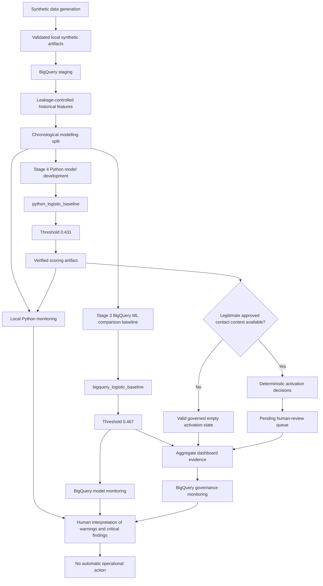

 Vitality Engagement Intelligence Engine Architecture

## Purpose

This document provides the end-to-end architecture for the Vitality Engagement Intelligence Engine portfolio project.

The repository uses fully synthetic data to demonstrate leakage-controlled feature engineering, chronological model evaluation, verified local artifacts, governed pending-human-review recommendations, aggregate dashboards, and read-only monitoring.

It is not a clinical system, operational outreach platform, eligibility engine, treatment system, or automated decision service.

Forecasts are not confirmed outcomes. Observed outcomes are descriptive, not causal. No monitoring or dashboard result authorises operational action.

## Architecture overview

The diagram represents a technical demonstration and repository workflow. It does not imply live production orchestration, automated member contact, or operational deployment.

## End-to-end data flow

| Step | Component | Repository location | Responsibility |
| ---: | --- | --- | --- |
| 1 | Synthetic data generation | `src/vitality_engagement/data/` | Reproducible synthetic member and engagement data |
| 2 | Dataset review | `docs/data_card.md`, `docs/data_distribution_review.md` | Dimensions, distributions, leakage controls, limitations, and review evidence |
| 3 | BigQuery staging | `sql/staging/` | Governed warehouse staging |
| 4 | Feature engineering | `sql/features/` | Leakage-controlled historical predictors |
| 5 | Chronological split | `sql/splits/` | Train, validation, test, and unlabelled scoring partitions |
| 6 | BigQuery ML baseline | `sql/models/`, `sql/evaluation/` | Stage 3 comparison model and threshold evidence |
| 7 | Python modelling | `src/vitality_engagement/models/` | Selected regularised logistic model |
| 8 | Governed scoring | `src/vitality_engagement/models/scoring_artifact.py` | Verified local Parquet and JSON scoring artifacts |
| 9 | Activation review | `src/vitality_engagement/activation/` | Deterministic decisions and pending-human-review queue when legitimate context exists |
| 10 | Aggregate dashboard | `sql/dashboard/`, `dashboards/` | Read-only governed views and validated Looker Studio pages |
| 11 | Monitoring | `src/vitality_engagement/monitoring/`, `sql/monitoring/` | Local drift checks and read-only warehouse monitoring |

## Cloud configuration

| Resource | Value |
| --- | --- |
| Google Cloud project | `vitality-engagement-43999` |
| BigQuery dataset | `vitality_engagement_dev` |
| BigQuery location | `asia-southeast1` |
| SQL runner | `scripts/run_bigquery_sql.ps1` |
| Default billing ceiling | `100000000` bytes |

The SQL runner supports dry runs and executes version-controlled SQL. Commands that modify BigQuery require valid authentication and confirmation of the project, dataset, location, and billing limit.

## Model identity separation

| Model | Threshold | Role |
| --- | ---: | --- |
| `python_logistic_baseline` | `0.431` | Selected Stage 4 Python model used for verified scoring |
| `bigquery_logistic_baseline` | `0.467` | Stage 3 BigQuery ML comparison baseline |

The model names and thresholds must always remain together.

The BigQuery baseline is not the selected activation-driving model. The Python threshold must not be applied to BigQuery predictions, and the BigQuery threshold must not be applied to Python predictions.

## Chronological modelling boundary

The governed modelling dataset contains 76,000 synthetic rows across 500 synthetic members.

| Split | Rows | Date range | Purpose |
| --- | ---: | --- | --- |
| Train | 46,000 | 2025-01-29 through 2025-04-30 | Model fitting |
| Validation | 15,500 | 2025-05-01 through 2025-05-31 | Model comparison and threshold selection |
| Test | 11,000 | 2025-06-01 through 2025-06-22 | Frozen model evaluation |
| Scoring | 3,500 | 2025-06-23 through 2025-06-29 | Unlabelled historical scoring snapshot |

Random train-test splitting is not used.

The scoring period has no available future target labels. Its forecasts must not be represented as confirmed performance or observed member outcomes.

## Verified local artifact lineage

### Modelling and scoring

The governed local workflow uses:

- `data/modeling/engagement_modeling_split.parquet`;
- the persisted selected Python model;
- the persisted selected-model metadata;
- `artifacts/scoring/python_logistic_scoring_predictions.parquet`;
- `artifacts/scoring/python_logistic_scoring_predictions.metadata.json`.

Model and scoring metadata preserve identity, threshold, schema, row counts, and SHA-256 lineage.

The scoring artifact contains forecasts for the 3,500 unlabelled rows. Forecasts are not confirmed outcomes.

### Activation

Activation requires a legitimate approved contact-context Parquet artifact and its matching metadata JSON.

The repository intentionally provides no default production contact-context path and does not fabricate contact context merely to avoid an empty state.

When valid prerequisites exist, the default local outputs are:

- `artifacts/activation/activation_decisions.parquet`;
- `artifacts/activation/activation_decisions.metadata.json`;
- `artifacts/activation/human_review_queue.parquet`;
- `artifacts/activation/human_review_queue.metadata.json`.

Every selected queue row remains `pending_human_review`.

Selected for review does not mean approved outreach.

The local activation command does not upload to BigQuery, contact members, dispatch interventions, or approve records for outreach.

Warehouse persistence is separate and must not be run merely to demonstrate that an uploader works.

### Monitoring

The default local monitoring outputs are:

- `artifacts/monitoring/monitoring_checks.parquet`;
- `artifacts/monitoring/monitoring_checks.metadata.json`.

Monitoring metadata records the run identity, timestamp, policy fingerprint, selected model identity, threshold, source paths, SHA-256 lineage, population counts, and check counts.

## Dashboard architecture

The Looker Studio dashboard consumes governed BigQuery views only.

It is:

- aggregate-only;
- read-only;
- fully synthetic;
- descriptive;
- non-operational;
- explicit about empty and invalid states;
- separated between forecasts and observed outcomes;
- protected by a subgroup suppression minimum of 10.

The dashboard contains no member search, member-level export, dispatch control, outreach approval, write-back, eligibility action, treatment action, or case-management control.

Dashboard visibility does not grant operational authority.

The validated dashboard contains five report pages, eight governed dashboard assets, and seven lineage rows.

## Monitoring architecture

### Local Python monitoring

The local command verifies the modelling data, persisted selected Python model, model metadata, scoring predictions, and scoring metadata before evaluating deterministic checks.

The governed Stage 7 evidence run evaluated 57 checks:

| Severity | Count |
| --- | ---: |
| Pass | 53 |
| Warning | 2 |
| Critical | 2 |

The non-passing checks were:

| Check | Observed value | Severity |
| --- | ---: | --- |
| Probability PSI | .155921 | Warning |
| `previous_goal_streak_as_of` PSI | `1.559510` | Critical |
| `previous_failed_goals_as_of` PSI | `0.290255` | Critical |
| `avg_goal_completion_percentage_28d` PSI | `0.109969` | Warning |

The critical findings were retained rather than hidden by weakening monitoring thresholds.

A local monitoring exit code of 2 means the monitoring run completed and found at least one governed critical condition. It is not an unhandled execution failure.

### BigQuery model monitoring

The read-only model-monitoring view is:

- `vitality_engagement_dev.model_monitoring_status`.

It evaluates the separate `bigquery_logistic_baseline` comparison model using threshold `0.467`.

The Stage 7 result contained nine passing checks and two critical training-support breaches.

### BigQuery governance monitoring

The read-only governance-monitoring view is:

- `vitality_engagement_dev.governance_monitoring_status`.

It evaluates:

- activation empty-state validity;
- dashboard quality;
- dashboard lineage and freshness.

The Stage 7 result contained three passing checks and no critical checks.

Both monitoring views set `operational_action_authorised` to `FALSE`.

## Human-review boundary

Human review is mandatory wherever interpretation, approval, or escalation is required.

The project does not automatically:

- contact members;
- dispatch interventions;
- approve outreach;
- create operational cases;
- alter eligibility;
- apply penalties;
- assign treatment;
- promote or replace a model;
- retrain a model;
- change a threshold;
- convert a forecast into a confirmed outcome.

A passing technical check does not establish clinical validity, fairness, causal effectiveness, privacy compliance, legal compliance, or production readiness.

A warning or critical monitoring result does not itself authorise corrective operational action.

## Fail-closed controls

The local artifact workflows reject invalid or unsafe inputs before final outputs are written.

Examples include:

- missing files;
- invalid or mismatched metadata;
- SHA-256 digest mismatches;
- unexpected schemas;
- duplicate contact-context member identifiers;
- naive, invalid, or future timestamps;
- model or threshold identity mismatches;
- invalid classifications;
- input-output path collisions;
- unsafe governance settings.

These controls improve technical integrity but do not prove real-world suitability.

## Responsible-use limitations

All project data is synthetic.

The project has not been validated with real members or real operational workflows.

Its results do not establish:

- clinical value;
- intervention effectiveness;
- causal impact;
- real-world fairness;
- production privacy compliance;
- legal or regulatory compliance;
- financial value;
- safe automated decision-making.

Stage 7 identified temporal shift and training-support concerns. Monitoring detects those concerns; it does not resolve them.

The selected Python threshold was based on validation positive-class F1, not clinical value, intervention cost, member harm, financial optimisation, or treatment effectiveness.

The subgroup suppression minimum of 10 is an engineering control for this synthetic portfolio. It is not claimed as a legal, regulatory, clinical, or production privacy standard.

## Related documentation

- [Repository README](../README.md)
- [Synthetic dataset card](data_card.md)
- [Dataset distribution review](data_distribution_review.md)
- [BigQuery and SQL architecture](bigquery_architecture.md)
- [BigQuery ML baseline results](bigquery_baseline_results.md)
- [Python model results](python_logistic_baseline_results.md)
- [Model card](model_card.md)
- [Activation policy](activation_policy.md)
- [Activation runbook](activation_runbook.md)
- [Dashboard requirements](dashboard_requirements.md)
- [Dashboard metric inventory](dashboard_metric_inventory.md)
- [Stage 6 dashboard evidence](stage_6_dashboard_evidence.md)
- [Monitoring policy](monitoring_policy.md)
- [Monitoring runbook](monitoring_runbook.md)
- [Stage 7 monitoring evidence](stage_7_monitoring_evidence.md)
